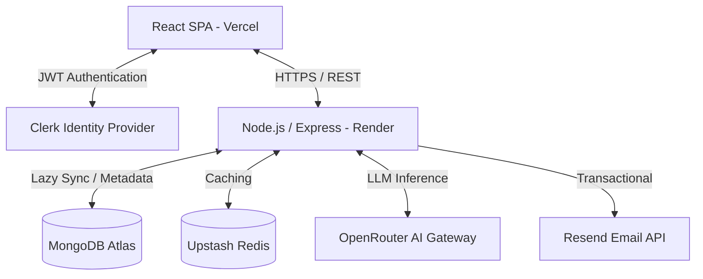
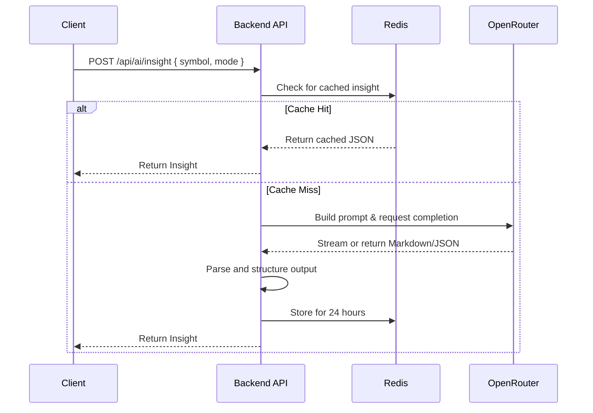
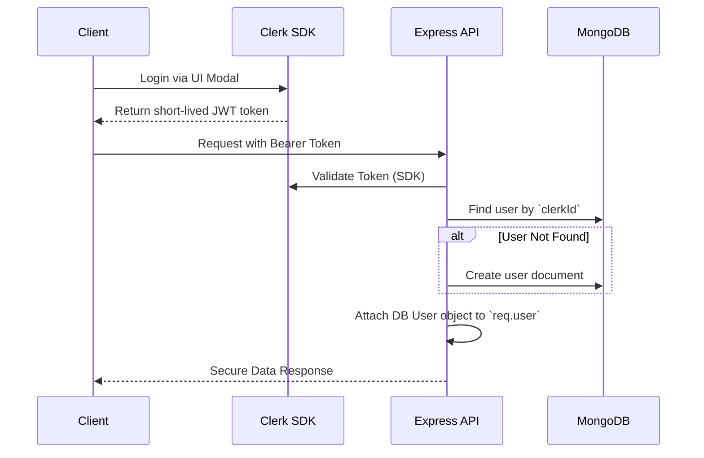

# AlphaLens Architecture

This document describes the high-level architecture of AlphaLens.

## Core System Architecture

AlphaLens follows a standard monolithic backend with a decoupled SPA frontend, utilizing modern serverless/managed infrastructure for specific concerns.

## AI Reasoning Flow

We use OpenRouter to access multiple LLMs (primarily `meta-llama/llama-3.1-8b-instruct`) without locking into a single provider. All AI requests go through our backend to ensure secrets are never exposed to the client.

## Authentication Flow (Clerk)

We migrated from a custom JWT system to Clerk. The backend utilizes "Lazy Syncing" to ensure every authenticated request maps to a MongoDB user.

